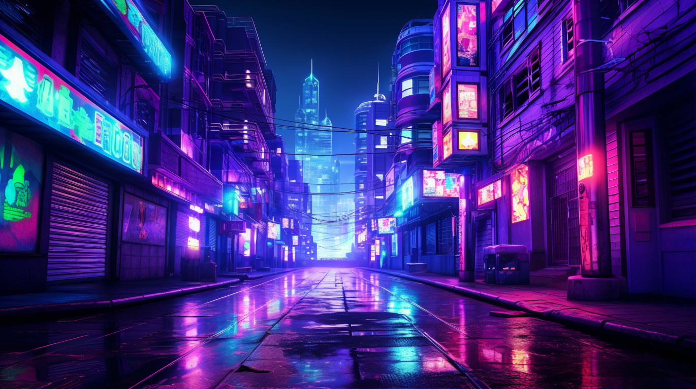
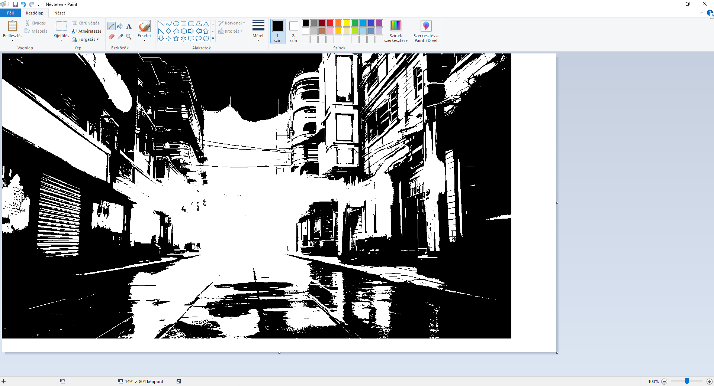

# python-paint-controller

This application draws a supplied image to MS Paint in black and white (either #000 or #FFF).

## Assumptions made by the application

1. Paint is either running ON the primary display or RIGHT to the primary display.
2. In Windows' Display settings Scaling is set to 100%. Other values might mess with the application.

## Dependencies

| name   | version |
|--------|---------|
| pynput | 1.7.6   |
| pillow | 10.3.0  |

All included in `requirements.txt`.

## Usage

```bash
python main.py <image_path> <canvas_width> <canvas_height> <canvas_offset_x> <canvas_offset_y> [primary_screen_width]
```

### Failsafe

If the cursor goes rogue, there is a failsafe built into the application. Pressing the `Home` key will stop the
application's execution.

### Arguments

* image_path: The path of the image for the application to draw in paint
* canvas_width: Width of Paint's canvas
* canvas_height: Height of Paint's canvas
* canvas_offset_x: Paint's canvas' (TOP-LEFT corner) offset from the display's left side in pixels
* canvas_offset_y: Paint's canvas' (TOP-LEFT corner) offset from the display's top in pixels
* primary_screen_width: (Optional) default 0. If Paint is running on the primary display leave out or set to 0.
    * This application assumes that Paint is running ON or to the RIGHT of the primary display.  
      If Paint is running to the RIGHT of the primary display set to the width of all the displays (in pixels) to the
      LEFT of Paint.

## Example

Input image


Output


## Notes

### Speed

This application runs really slow, partly because of Paint, partly because without any sleep() in the main loop the
cursor goes rogue. The example output took at least half an hour to produce.

## Sources

Example Image: https://www.freepik.com/free-ai-image/cyberpunk-urban-scenery_60201746.htm#query=cyberpunk&position=0&from_view=keyword&track=sph&uuid=16748b0f-cb43-4c34-9879-e78dd0a7ebdc